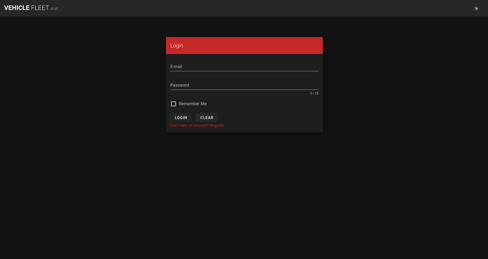
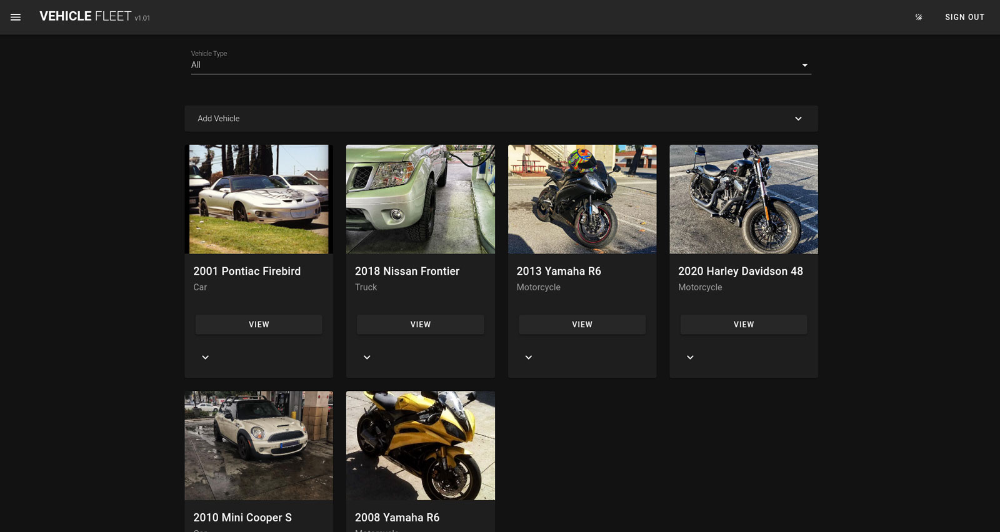
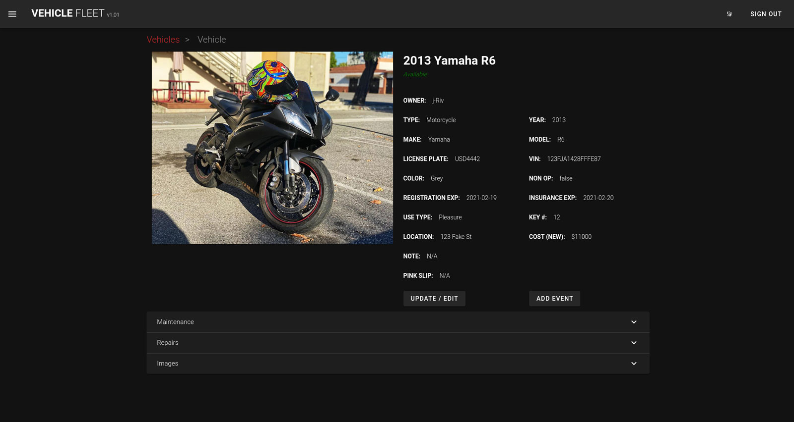

# FLEET TRACKER
> An app to track your companies vehicles or your own. Powered by Vue.js

Create maintenance and repair events / records, and automatically add and share them to your Google Calendar. Save and associate files and images to vehicles or records.

## Project setup
```
yarn install
```

## Create Config
Create Google Apps Config & General Settings Config
```
touch /src/config/google.ts
cp /src/config/sample.ts /src/config/index.ts
```
```javascript
export const Google = {
  apiKey: API KEY,
  clientId: CLIENT ID,
  discoveryDocs: DISCOVERY DOCS,
  scope: SCOPE,
  calendarId: CALENDAR ID,
};
```
Settings are located at /src/config/

```javascript
export const vehicleTracker = {
  name: 'Vehicle',
  version: 'v1.01',
};

export const baseImageUrl = 'http://localhost:3000/public/uploads/vehicles';

// used for form elements
export const settings = {
  vehicle: {
    colors: [
      'N/A',
      'Black',
      'Blue',
      'Brown',
      'Burgundy',
      'Cream',
      'Green',
      'Grey',
      'Orange',
      'Pink',
      'Purple',
      'Red',
      'Silver',
      'White',
      'Yellow',
    ],
    types: ['Car', 'Motorcycle', 'Recreational', 'Trailer', 'Truck', 'Van'],
    statuses: [{ text: 'Active' }, { text: 'Out Of Service' }],
    attributes: {
      owner: 'Owner',
      name: 'Vehicle Name',
      plates: 'License Plate',
      vin: 'VIN',
      make: 'Vehicle Make',
      model: 'Vehicle Model',
      color: 'Color',
      email: 'E-mail Address',
      note: 'Notes',
    },
    uses: [{ text: 'Service' }, { text: 'Retail' }, { text: 'Commercial' }, { text: 'Pleasure' }],
    addresses: ['123 Fake St, Some Town, CA, 90001']
  }
}
```

### Compiles and hot-reloads for development
```
yarn run serve
```

### Compiles and minifies for production
```
yarn run build
```


